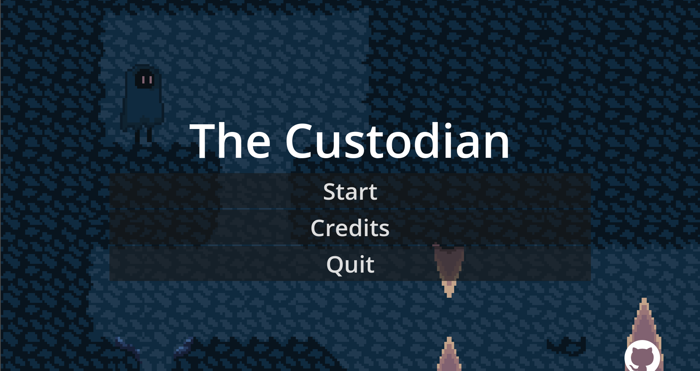

# The Custodian

A puzzle-platformer built from scratch in just 48 hours at the Hack Club Daydream Helsinki Game Jam 2025!

## Overview

**The Custodian** is a pixel-art puzzle-platformer where you guide a mysterious entity through four atmospheric levels filled with perilous traps and environmental puzzles. It was created by a team of three high school students with minimal prior game development experience during a rapid, two-day game jam.

## Features

- **Four hand-crafted levels**: Each presents distinct challenges, mechanics, and obstacles.
- **Unique pixel-art style**: Atmospheric backgrounds and a mysterious protagonist.
- **Physics-based platforming**: Moving platforms, falling obstacles, gravity wells, and more.
- **Checkpoints and power-ups**: Master each challenge and advance through the game.
- **Original SFX and sound cues**.

## Team & Credits

- **Programming**: Sukarth, Hekinav & Ropva
- **Level Design**: Sukarth
- **Artists**: Ropva & Hekinav
- **Sound Effects**: Ropva & Hekinav

## How to Play

Visit https://hekinav.itch.io/the-custodian

OR:

1. Open the project in [Godot Engine](https://godotengine.org/).
2. Run the main scene (`game.tscn`).
3. Use keyboard controls (default WASD or arrow keys) to move and jump.
4. Reach the exit in each level to progress.

## Repository Structure

- `/levels` & `/player`: Scene files and assets for levels and player control
- `/scripts`: Game logic written in GDScript
- `/sfx`: Sound effect files
- `/ui`: UI and menu scenes

## License

This project is released as open-source under the MIT License. See `LICENSE` file for details.

## Inspiration & Acknowledgements

Created as part of [Daydream Hack Club Helsinki](https://daydream.hackclub.com/helsinki) Game Jam 2025—an amazingly organized event bringing together high schoolers for creative game development!

Special thanks to the organizers, mentors, and fellow participants for their support and inspiration.

---

 

Built with ❤️ by Sukarth, Hekinav, & Ropva
